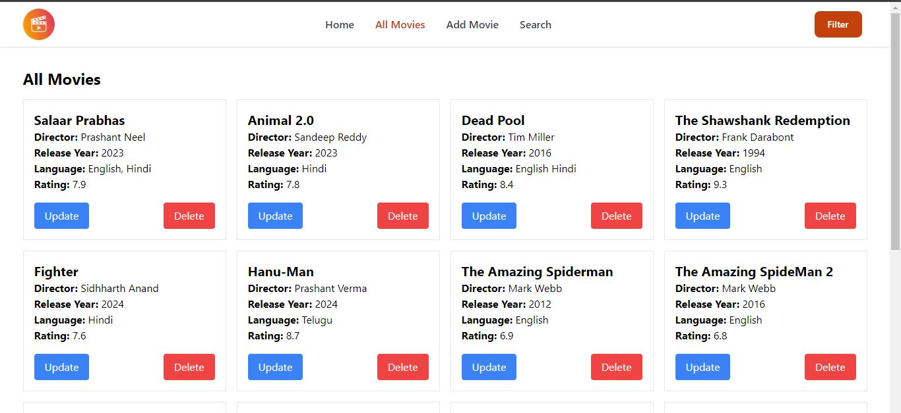
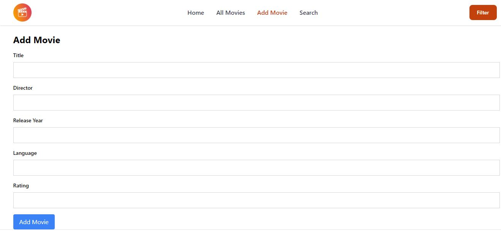
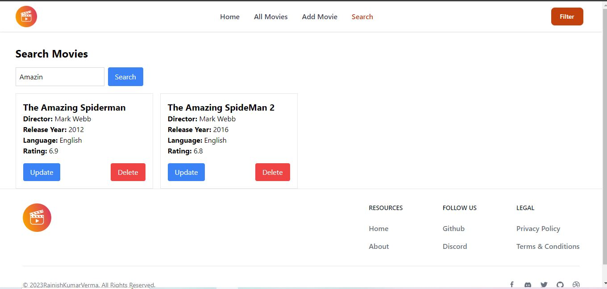
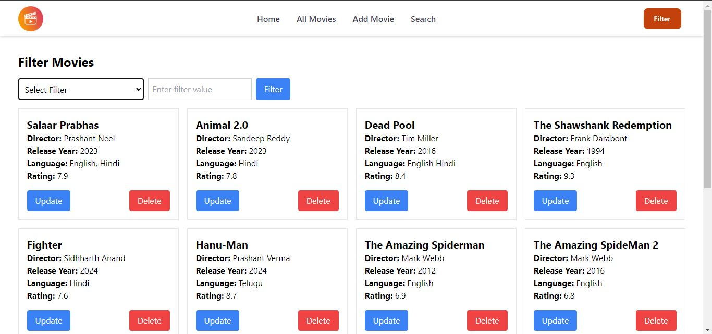

#A backend Application for Listing movies based on different criterias.


A backend Application for Listing movies based on different criterias.


# MovieList Application platform (v1)

>Simple Movie Listing with advanced search options using react and Tailwind CSS.








This project is part of my [Backend Project | Movie Listing Platform] Presidio Task. It is a full-featured Movie listing with advanced search Features. See it in action at (https://movielistapp-xi.vercel.app)

This is version 1.0 of the app. The first version can be found [here](https://movielistapp-xi.vercel.app)

<!-- toc -->

- [Features](#features)
- [Usage](#usage)
  - [Env Variables](#env-variables)
  - [Install Dependencies ](#install-dependencies)
  - [Run](#run)

## Features

- All Movie Listing
- Add a movie
- Search Movie
- Update Movie
- delete Movie
- seach based on different crieteria
- search by title
- search by director
- search by rating
- search by release year
- search by language


## Usage

- Create a MongoDB database and obtain your `MongoDB URI` - [MongoDB Atlas](https://www.mongodb.com/cloud/atlas/register)

### Env Variables

create the `.env` and add the following

```
PORT=5000
MONGODB_URI=your mongodb uri
CORS_ORIGIN= application frontend Url
PAGINATION_LIMIT=8
```

Change the  PAGINATION_LIMIT to what you want

### Install Dependencies (frontend & backend)

```
npm install

```

### Run

```

# Run backend only
npm run dev
```

#### Json Request and response

```
{
	"info": {
		"_postman_id": "a0af28ef-a243-4a95-9bff-323cb06cdf97",
		"name": "MovieListApp",
		"description": "A collection for listing movies based on different criterias. plus add movie deletemovie,and update movie feature are included.",
		"schema": "https://schema.getpostman.com/json/collection/v2.1.0/collection.json",
		"_exporter_id": "31287750"
	},
	"item": [
		{
			"name": "Add Movie",
			"request": {
				"method": "POST",
				"header": [],
				"body": {
					"mode": "raw",
					"raw": "{\r\n   \"title\":\"Article 370\",\r\n   \"director\":\"Anubhav Sinha\",\r\n   \"releaseyear\": \"2023\",\r\n   \"language\": \"Hindi\",\r\n   \"rating\":\"8.1\"\r\n}",
					"options": {
						"raw": {
							"language": "json"
						}
					}
				},
				"url": {
					"raw": "https://movielistapp.onrender.com/api/v1/movie/add",
					"protocol": "https",
					"host": [
						"movielistapp",
						"onrender",
						"com"
					],
					"path": [
						"api",
						"v1",
						"movie",
						"add"
					]
				}
			},
			"response": [
				{
					"name": "Add Movie",
					"originalRequest": {
						"method": "POST",
						"header": [],
						"body": {
							"mode": "raw",
							"raw": "{\r\n   \"title\":\"Article 370\",\r\n   \"director\":\"Anubhav Sinha\",\r\n   \"releaseyear\": \"2023\",\r\n   \"language\": \"Hindi\",\r\n   \"rating\":\"8.1\"\r\n}",
							"options": {
								"raw": {
									"language": "json"
								}
							}
						},
						"url": {
							"raw": "https://movielistapp.onrender.com/api/v1/movie/add",
							"protocol": "https",
							"host": [
								"movielistapp",
								"onrender",
								"com"
							],
							"path": [
								"api",
								"v1",
								"movie",
								"add"
							]
						}
					},
					"status": "OK",
					"code": 200,
					"_postman_previewlanguage": "json",
					"header": [
						{
							"key": "Date",
							"value": "Thu, 01 Feb 2024 03:32:32 GMT"
						},
						{
							"key": "Content-Type",
							"value": "application/json; charset=utf-8"
						},
						{
							"key": "Transfer-Encoding",
							"value": "chunked"
						},
						{
							"key": "Connection",
							"value": "keep-alive"
						},
						{
							"key": "CF-Ray",
							"value": "84e71d1b2f4e7f77-MAA"
						},
						{
							"key": "CF-Cache-Status",
							"value": "DYNAMIC"
						},
						{
							"key": "ETag",
							"value": "W/\"12a-svWBVTTqNErOi+b+dNjgawOP47c\""
						},
						{
							"key": "Vary",
							"value": "Accept-Encoding"
						},
						{
							"key": "access-control-allow-credentials",
							"value": "true"
						},
						{
							"key": "rndr-id",
							"value": "8e8717ad-854a-4288"
						},
						{
							"key": "x-powered-by",
							"value": "Express"
						},
						{
							"key": "x-render-origin-server",
							"value": "Render"
						},
						{
							"key": "Server",
							"value": "cloudflare"
						},
						{
							"key": "Content-Encoding",
							"value": "br"
						},
						{
							"key": "alt-svc",
							"value": "h3=\":443\"; ma=86400"
						}
					],
					"cookie": [],
					"body": "{\n    \"statusCode\": 200,\n    \"data\": {\n        \"_id\": \"65bb10cfbc4767b0e62fd0c0\",\n        \"title\": \"Article 370\",\n        \"director\": \"Anubhav Sinha\",\n        \"releaseyear\": 2023,\n        \"language\": \"Hindi\",\n        \"rating\": 8.1,\n        \"createdAt\": \"2024-02-01T03:32:31.959Z\",\n        \"updatedAt\": \"2024-02-01T03:32:31.959Z\",\n        \"__v\": 0\n    },\n    \"message\": \"Movie Added Successfully\",\n    \"success\": true\n}"
				}
			]
		},
		{
			"name": "get All movies",
			"protocolProfileBehavior": {
				"disableBodyPruning": true
			},
			"request": {
				"method": "GET",
				"header": [],
				"body": {
					"mode": "raw",
					"raw": "",
					"options": {
						"raw": {
							"language": "json"
						}
					}
				},
				"url": {
					"raw": "https://movielistapp.onrender.com/api/v1/movie/movies",
					"protocol": "https",
					"host": [
						"movielistapp",
						"onrender",
						"com"
					],
					"path": [
						"api",
						"v1",
						"movie",
						"movies"
					]
				}
			},
			"response": [
				{
					"name": "get All movies",
					"originalRequest": {
						"method": "GET",
						"header": [],
						"body": {
							"mode": "raw",
							"raw": "",
							"options": {
								"raw": {
									"language": "json"
								}
							}
						},
						"url": {
							"raw": "https://movielistapp.onrender.com/api/v1/movie/movies",
							"protocol": "https",
							"host": [
								"movielistapp",
								"onrender",
								"com"
							],
							"path": [
								"api",
								"v1",
								"movie",
								"movies"
							]
						}
					},
					"status": "OK",
					"code": 200,
					"_postman_previewlanguage": "json",
					"header": [
						{
							"key": "Date",
							"value": "Thu, 01 Feb 2024 03:35:54 GMT"
						},
						{
							"key": "Content-Type",
							"value": "application/json; charset=utf-8"
						},
						{
							"key": "Transfer-Encoding",
							"value": "chunked"
						},
						{
							"key": "Connection",
							"value": "keep-alive"
						},
						{
							"key": "CF-Ray",
							"value": "84e725a1fa1a7f77-MAA"
						},
						{
							"key": "CF-Cache-Status",
							"value": "DYNAMIC"
						},
						{
							"key": "ETag",
							"value": "W/\"de9-YuVnMmtqBmLK3gapEwOtK9Wiots\""
						},
						{
							"key": "Vary",
							"value": "Accept-Encoding"
						},
						{
							"key": "access-control-allow-credentials",
							"value": "true"
						},
						{
							"key": "rndr-id",
							"value": "4cf0f20a-36d6-404e"
						},
						{
							"key": "x-powered-by",
							"value": "Express"
						},
						{
							"key": "x-render-origin-server",
							"value": "Render"
						},
						{
							"key": "Server",
							"value": "cloudflare"
						},
						{
							"key": "Content-Encoding",
							"value": "br"
						},
						{
							"key": "alt-svc",
							"value": "h3=\":443\"; ma=86400"
						}
					],
					"cookie": [],
					"body": "{\n    \"statusCode\": 200,\n    \"data\": {\n        \"movies\": [\n            {\n                \"_id\": \"65ba2df887928737e903f907\",\n                \"title\": \"Salaar Part 1 : CeaseFire\",\n                \"director\": \"Prashant Neel\",\n                \"releaseyear\": 2023,\n                \"language\": \"English, Hindi, Telugu, Tamil, Malayalam\",\n                \"rating\": 7.9,\n                \"createdAt\": \"2024-01-31T11:24:40.282Z\",\n                \"updatedAt\": \"2024-02-01T02:58:36.668Z\",\n                \"__v\": 0\n            },\n            {\n                \"_id\": \"65ba2e2387928737e903f911\",\n                \"title\": \"Animal 2.0\",\n                \"director\": \"Sandeep Reddy\",\n                \"releaseyear\": 2023,\n                \"language\": \"Hindi\",\n                \"rating\": 7.8,\n                \"createdAt\": \"2024-01-31T11:25:23.620Z\",\n                \"updatedAt\": \"2024-01-31T17:59:21.477Z\",\n                \"__v\": 0\n            },\n            {\n                \"_id\": \"65ba30952466c2da77fc509a\",\n                \"title\": \"Dead Pool\",\n                \"director\": \"Tim Miller\",\n                \"releaseyear\": 2016,\n                \"language\": \"English Hindi\",\n                \"rating\": 8.4,\n                \"createdAt\": \"2024-01-31T11:35:49.597Z\",\n                \"updatedAt\": \"2024-01-31T12:58:46.112Z\",\n                \"__v\": 0\n            },\n            {\n                \"_id\": \"65ba50a2aec862716dcccf3c\",\n                \"title\": \"The Shawshank Redemption\",\n                \"director\": \"Frank Darabont\",\n                \"releaseyear\": 1994,\n                \"language\": \"English\",\n                \"rating\": 9.3,\n                \"createdAt\": \"2024-01-31T13:52:34.521Z\",\n                \"updatedAt\": \"2024-01-31T13:52:34.521Z\",\n                \"__v\": 0\n            },\n            {\n                \"_id\": \"65ba511eaec862716dcccf46\",\n                \"title\": \"Fighter\",\n                \"director\": \"Sidhharth Anand\",\n                \"releaseyear\": 2024,\n                \"language\": \"Hindi\",\n                \"rating\": 7.6,\n                \"createdAt\": \"2024-01-31T13:54:38.020Z\",\n                \"updatedAt\": \"2024-01-31T13:54:38.020Z\",\n                \"__v\": 0\n            },\n            {\n                \"_id\": \"65ba5142aec862716dcccf50\",\n                \"title\": \"Hanu-Man\",\n                \"director\": \"Prashant Verma\",\n                \"releaseyear\": 2024,\n                \"language\": \"Telugu\",\n                \"rating\": 8.7,\n                \"createdAt\": \"2024-01-31T13:55:14.667Z\",\n                \"updatedAt\": \"2024-01-31T13:55:14.667Z\",\n                \"__v\": 0\n            },\n            {\n                \"_id\": \"65ba5191aec862716dcccf5a\",\n                \"title\": \"The Amazing Spiderman\",\n                \"director\": \"Mark Webb\",\n                \"releaseyear\": 2012,\n                \"language\": \"English\",\n                \"rating\": 6.9,\n                \"createdAt\": \"2024-01-31T13:56:33.432Z\",\n                \"updatedAt\": \"2024-01-31T13:56:33.432Z\",\n                \"__v\": 0\n            },\n            {\n                \"_id\": \"65ba51d1aec862716dcccf64\",\n                \"title\": \"The Amazing SpideMan 2\",\n                \"director\": \"Mark Webb\",\n                \"releaseyear\": 2016,\n                \"language\": \"English\",\n                \"rating\": 6.8,\n                \"createdAt\": \"2024-01-31T13:57:37.902Z\",\n                \"updatedAt\": \"2024-01-31T13:57:37.902Z\",\n                \"__v\": 0\n            },\n            {\n                \"_id\": \"65ba5225aec862716dcccf6e\",\n                \"title\": \"Avenger\",\n                \"director\": \"Russo Brother\",\n                \"releaseyear\": 2012,\n                \"language\": \"English\",\n                \"rating\": 8,\n                \"createdAt\": \"2024-01-31T13:59:01.697Z\",\n                \"updatedAt\": \"2024-01-31T13:59:01.697Z\",\n                \"__v\": 0\n            },\n            {\n                \"_id\": \"65ba5254aec862716dcccf78\",\n                \"title\": \"Avenger: Endgame\",\n                \"director\": \"Anthony and Joe Russo\",\n                \"releaseyear\": 2015,\n                \"language\": \"English\",\n                \"rating\": 9.6,\n                \"createdAt\": \"2024-01-31T13:59:48.858Z\",\n                \"updatedAt\": \"2024-01-31T13:59:48.858Z\",\n                \"__v\": 0\n            },\n            {\n                \"_id\": \"65ba59eecff4bb32bfe2ddc2\",\n                \"title\": \"Article 371\",\n                \"director\": \"Anubhav Sinha\",\n                \"releaseyear\": 2023,\n                \"language\": \"Hindi\",\n                \"rating\": 8.1,\n                \"createdAt\": \"2024-01-31T14:32:14.173Z\",\n                \"updatedAt\": \"2024-01-31T15:20:18.460Z\",\n                \"__v\": 0\n            },\n            {\n                \"_id\": \"65ba839db95a12e905c096e9\",\n                \"title\": \"Fighter 2\",\n                \"director\": \"Aman Singh\",\n                \"releaseyear\": 2024,\n                \"language\": \"Hindi\",\n                \"rating\": 8.9,\n                \"createdAt\": \"2024-01-31T17:30:05.376Z\",\n                \"updatedAt\": \"2024-01-31T17:30:05.376Z\",\n                \"__v\": 0\n            },\n            {\n                \"_id\": \"65bb08ba49cb3e9b2d3ed02d\",\n                \"title\": \"Bahubali\",\n                \"director\": \"S S Rajamouli\",\n                \"releaseyear\": 2015,\n                \"language\": \"Telugu, Hindi, Tamil\",\n                \"rating\": 8.5,\n                \"createdAt\": \"2024-02-01T02:58:02.547Z\",\n                \"updatedAt\": \"2024-02-01T02:58:02.547Z\",\n                \"__v\": 0\n            },\n            {\n                \"_id\": \"65bb091c49cb3e9b2d3ed041\",\n                \"title\": \"Bahubali The Conclusion\",\n                \"director\": \"S S Rajamouli\",\n                \"releaseyear\": 2017,\n                \"language\": \"Telugu , Hindi, Tamil, English\",\n                \"rating\": 8.9,\n                \"createdAt\": \"2024-02-01T02:59:40.822Z\",\n                \"updatedAt\": \"2024-02-01T02:59:40.822Z\",\n                \"__v\": 0\n            },\n            {\n                \"_id\": \"65bb10cfbc4767b0e62fd0c0\",\n                \"title\": \"Article 370\",\n                \"director\": \"Anubhav Sinha\",\n                \"releaseyear\": 2023,\n                \"language\": \"Hindi\",\n                \"rating\": 8.1,\n                \"createdAt\": \"2024-02-01T03:32:31.959Z\",\n                \"updatedAt\": \"2024-02-01T03:32:31.959Z\",\n                \"__v\": 0\n            }\n        ],\n        \"page\": 1,\n        \"pages\": 1\n    },\n    \"message\": \"Movie Loaded Successfully\",\n    \"success\": true\n}"
				}
			]
		},
		{
			"name": "Update a movie",
			"request": {
				"method": "PUT",
				"header": [],
				"body": {
					"mode": "raw",
					"raw": "{\r\n   \"title\":\"Salaar Prabhas\",\r\n   \"director\":\"Prashant Neel\",\r\n   \"releaseyear\": \"2023\",\r\n   \"language\": \"English, Hindi\",\r\n   \"rating\":\"7.9\"\r\n}",
					"options": {
						"raw": {
							"language": "json"
						}
					}
				},
				"url": {
					"raw": "https://movielistapp.onrender.com/api/v1/movie/65ba2df887928737e903f907",
					"protocol": "https",
					"host": [
						"movielistapp",
						"onrender",
						"com"
					],
					"path": [
						"api",
						"v1",
						"movie",
						"65ba2df887928737e903f907"
					]
				}
			},
			"response": [
				{
					"name": "Update a movie",
					"originalRequest": {
						"method": "PUT",
						"header": [],
						"body": {
							"mode": "raw",
							"raw": "{\r\n   \"title\":\"Salaar Prabhas\",\r\n   \"director\":\"Prashant Neel\",\r\n   \"releaseyear\": \"2023\",\r\n   \"language\": \"English, Hindi\",\r\n   \"rating\":\"7.9\"\r\n}",
							"options": {
								"raw": {
									"language": "json"
								}
							}
						},
						"url": {
							"raw": "https://movielistapp.onrender.com/api/v1/movie/65ba30952466c2da77fc509a",
							"protocol": "https",
							"host": [
								"movielistapp",
								"onrender",
								"com"
							],
							"path": [
								"api",
								"v1",
								"movie",
								"65ba30952466c2da77fc509a"
							]
						}
					},
					"status": "OK",
					"code": 200,
					"_postman_previewlanguage": "json",
					"header": [
						{
							"key": "Date",
							"value": "Thu, 01 Feb 2024 03:36:48 GMT"
						},
						{
							"key": "Content-Type",
							"value": "application/json; charset=utf-8"
						},
						{
							"key": "Transfer-Encoding",
							"value": "chunked"
						},
						{
							"key": "Connection",
							"value": "keep-alive"
						},
						{
							"key": "CF-Ray",
							"value": "84e726f65a2b7f77-MAA"
						},
						{
							"key": "CF-Cache-Status",
							"value": "DYNAMIC"
						},
						{
							"key": "ETag",
							"value": "W/\"138-iwxlHNe3fVaO88PiHIBM4a8ahTk\""
						},
						{
							"key": "Vary",
							"value": "Accept-Encoding"
						},
						{
							"key": "access-control-allow-credentials",
							"value": "true"
						},
						{
							"key": "rndr-id",
							"value": "e7fabc71-0249-41b6"
						},
						{
							"key": "x-powered-by",
							"value": "Express"
						},
						{
							"key": "x-render-origin-server",
							"value": "Render"
						},
						{
							"key": "Server",
							"value": "cloudflare"
						},
						{
							"key": "Content-Encoding",
							"value": "br"
						},
						{
							"key": "alt-svc",
							"value": "h3=\":443\"; ma=86400"
						}
					],
					"cookie": [],
					"body": "{\n    \"statusCode\": 200,\n    \"data\": {\n        \"_id\": \"65ba30952466c2da77fc509a\",\n        \"title\": \"Salaar Prabhas\",\n        \"director\": \"Prashant Neel\",\n        \"releaseyear\": 2023,\n        \"language\": \"English, Hindi\",\n        \"rating\": 7.9,\n        \"createdAt\": \"2024-01-31T11:35:49.597Z\",\n        \"updatedAt\": \"2024-02-01T03:36:48.547Z\",\n        \"__v\": 0\n    },\n    \"message\": \"Movie Updated Successfully\",\n    \"success\": true\n}"
				}
			]
		},
		{
			"name": "Delete a movie",
			"request": {
				"method": "DELETE",
				"header": [],
				"url": {
					"raw": "https://movielistapp.onrender.com/api/v1/movie/65b9d404144e491b61498c59",
					"protocol": "https",
					"host": [
						"movielistapp",
						"onrender",
						"com"
					],
					"path": [
						"api",
						"v1",
						"movie",
						"65b9d404144e491b61498c59"
					]
				}
			},
			"response": [
				{
					"name": "Delete a movie",
					"originalRequest": {
						"method": "DELETE",
						"header": [],
						"url": {
							"raw": "https://movielistapp.onrender.com/api/v1/movie/65ba30952466c2da77fc509a",
							"protocol": "https",
							"host": [
								"movielistapp",
								"onrender",
								"com"
							],
							"path": [
								"api",
								"v1",
								"movie",
								"65ba30952466c2da77fc509a"
							]
						}
					},
					"status": "OK",
					"code": 200,
					"_postman_previewlanguage": "json",
					"header": [
						{
							"key": "Date",
							"value": "Thu, 01 Feb 2024 03:37:00 GMT"
						},
						{
							"key": "Content-Type",
							"value": "application/json; charset=utf-8"
						},
						{
							"key": "Transfer-Encoding",
							"value": "chunked"
						},
						{
							"key": "Connection",
							"value": "keep-alive"
						},
						{
							"key": "CF-Ray",
							"value": "84e72740fbfa7f77-MAA"
						},
						{
							"key": "CF-Cache-Status",
							"value": "DYNAMIC"
						},
						{
							"key": "ETag",
							"value": "W/\"52-H51/2BrueTSFQMUuyuX16B1WT00\""
						},
						{
							"key": "Vary",
							"value": "Accept-Encoding"
						},
						{
							"key": "access-control-allow-credentials",
							"value": "true"
						},
						{
							"key": "rndr-id",
							"value": "2e5a774c-1b99-40b8"
						},
						{
							"key": "x-powered-by",
							"value": "Express"
						},
						{
							"key": "x-render-origin-server",
							"value": "Render"
						},
						{
							"key": "Server",
							"value": "cloudflare"
						},
						{
							"key": "Content-Encoding",
							"value": "br"
						},
						{
							"key": "alt-svc",
							"value": "h3=\":443\"; ma=86400"
						}
					],
					"cookie": [],
					"body": "{\n    \"statusCode\": 200,\n    \"data\": \"\",\n    \"message\": \"Movie Deleted Successfully\",\n    \"success\": true\n}"
				}
			]
		},
		{
			"name": "Search a movie",
			"request": {
				"method": "GET",
				"header": [],
				"url": {
					"raw": "https://movielistapp.onrender.com/api/v1/movie/search?q=Animal",
					"protocol": "https",
					"host": [
						"movielistapp",
						"onrender",
						"com"
					],
					"path": [
						"api",
						"v1",
						"movie",
						"search"
					],
					"query": [
						{
							"key": "q",
							"value": "Animal"
						}
					]
				}
			},
			"response": [
				{
					"name": "Search a movie",
					"originalRequest": {
						"method": "GET",
						"header": [],
						"url": {
							"raw": "https://movielistapp.onrender.com/api/v1/movie/search?q=AMAZING",
							"protocol": "https",
							"host": [
								"movielistapp",
								"onrender",
								"com"
							],
							"path": [
								"api",
								"v1",
								"movie",
								"search"
							],
							"query": [
								{
									"key": "q",
									"value": "AMAZING"
								}
							]
						}
					},
					"status": "OK",
					"code": 200,
					"_postman_previewlanguage": "json",
					"header": [
						{
							"key": "Date",
							"value": "Thu, 01 Feb 2024 03:37:16 GMT"
						},
						{
							"key": "Content-Type",
							"value": "application/json; charset=utf-8"
						},
						{
							"key": "Transfer-Encoding",
							"value": "chunked"
						},
						{
							"key": "Connection",
							"value": "keep-alive"
						},
						{
							"key": "CF-Ray",
							"value": "84e727a879a27f77-MAA"
						},
						{
							"key": "CF-Cache-Status",
							"value": "DYNAMIC"
						},
						{
							"key": "ETag",
							"value": "W/\"20e-xV1Ud5MT96Vu68f0QcsVN8ZgDwQ\""
						},
						{
							"key": "Vary",
							"value": "Accept-Encoding"
						},
						{
							"key": "access-control-allow-credentials",
							"value": "true"
						},
						{
							"key": "rndr-id",
							"value": "f42d392c-8b20-40e4"
						},
						{
							"key": "x-powered-by",
							"value": "Express"
						},
						{
							"key": "x-render-origin-server",
							"value": "Render"
						},
						{
							"key": "Server",
							"value": "cloudflare"
						},
						{
							"key": "Content-Encoding",
							"value": "br"
						},
						{
							"key": "alt-svc",
							"value": "h3=\":443\"; ma=86400"
						}
					],
					"cookie": [],
					"body": "{\n    \"statusCode\": 200,\n    \"data\": [\n        {\n            \"_id\": \"65ba5191aec862716dcccf5a\",\n            \"title\": \"The Amazing Spiderman\",\n            \"director\": \"Mark Webb\",\n            \"releaseyear\": 2012,\n            \"language\": \"English\",\n            \"rating\": 6.9,\n            \"createdAt\": \"2024-01-31T13:56:33.432Z\",\n            \"updatedAt\": \"2024-01-31T13:56:33.432Z\",\n            \"__v\": 0\n        },\n        {\n            \"_id\": \"65ba51d1aec862716dcccf64\",\n            \"title\": \"The Amazing SpideMan 2\",\n            \"director\": \"Mark Webb\",\n            \"releaseyear\": 2016,\n            \"language\": \"English\",\n            \"rating\": 6.8,\n            \"createdAt\": \"2024-01-31T13:57:37.902Z\",\n            \"updatedAt\": \"2024-01-31T13:57:37.902Z\",\n            \"__v\": 0\n        }\n    ],\n    \"message\": \"Movie Found \",\n    \"success\": true\n}"
				}
			]
		},
		{
			"name": "filter by name",
			"request": {
				"method": "GET",
				"header": [],
				"url": {
					"raw": "https://movielistapp.onrender.com/api/v1/movie/filterbyname?name=Animal",
					"protocol": "https",
					"host": [
						"movielistapp",
						"onrender",
						"com"
					],
					"path": [
						"api",
						"v1",
						"movie",
						"filterbyname"
					],
					"query": [
						{
							"key": "name",
							"value": "Animal"
						}
					]
				}
			},
			"response": [
				{
					"name": "filter by name",
					"originalRequest": {
						"method": "GET",
						"header": [],
						"url": {
							"raw": "https://movielistapp.onrender.com/api/v1/movie/filterbyname?name=bahubali",
							"protocol": "https",
							"host": [
								"movielistapp",
								"onrender",
								"com"
							],
							"path": [
								"api",
								"v1",
								"movie",
								"filterbyname"
							],
							"query": [
								{
									"key": "name",
									"value": "bahubali"
								}
							]
						}
					},
					"status": "OK",
					"code": 200,
					"_postman_previewlanguage": "json",
					"header": [
						{
							"key": "Date",
							"value": "Thu, 01 Feb 2024 03:37:47 GMT"
						},
						{
							"key": "Content-Type",
							"value": "application/json; charset=utf-8"
						},
						{
							"key": "Transfer-Encoding",
							"value": "chunked"
						},
						{
							"key": "Connection",
							"value": "keep-alive"
						},
						{
							"key": "CF-Ray",
							"value": "84e72865fcc77f77-MAA"
						},
						{
							"key": "CF-Cache-Status",
							"value": "DYNAMIC"
						},
						{
							"key": "ETag",
							"value": "W/\"245-qE31jCIEuaOxAzi9b40t5lkm7QE\""
						},
						{
							"key": "Vary",
							"value": "Accept-Encoding"
						},
						{
							"key": "access-control-allow-credentials",
							"value": "true"
						},
						{
							"key": "rndr-id",
							"value": "fca78a44-b522-44d8"
						},
						{
							"key": "x-powered-by",
							"value": "Express"
						},
						{
							"key": "x-render-origin-server",
							"value": "Render"
						},
						{
							"key": "Server",
							"value": "cloudflare"
						},
						{
							"key": "Content-Encoding",
							"value": "br"
						},
						{
							"key": "alt-svc",
							"value": "h3=\":443\"; ma=86400"
						}
					],
					"cookie": [],
					"body": "{\n    \"statusCode\": 200,\n    \"data\": [\n        {\n            \"_id\": \"65bb08ba49cb3e9b2d3ed02d\",\n            \"title\": \"Bahubali\",\n            \"director\": \"S S Rajamouli\",\n            \"releaseyear\": 2015,\n            \"language\": \"Telugu, Hindi, Tamil\",\n            \"rating\": 8.5,\n            \"createdAt\": \"2024-02-01T02:58:02.547Z\",\n            \"updatedAt\": \"2024-02-01T02:58:02.547Z\",\n            \"__v\": 0\n        },\n        {\n            \"_id\": \"65bb091c49cb3e9b2d3ed041\",\n            \"title\": \"Bahubali The Conclusion\",\n            \"director\": \"S S Rajamouli\",\n            \"releaseyear\": 2017,\n            \"language\": \"Telugu , Hindi, Tamil, English\",\n            \"rating\": 8.9,\n            \"createdAt\": \"2024-02-01T02:59:40.822Z\",\n            \"updatedAt\": \"2024-02-01T02:59:40.822Z\",\n            \"__v\": 0\n        }\n    ],\n    \"message\": \"Movie Filtered by Name Successfully\",\n    \"success\": true\n}"
				}
			]
		},
		{
			"name": "Filter by Director",
			"request": {
				"method": "GET",
				"header": [],
				"url": {
					"raw": "https://movielistapp.onrender.com/api/v1/movie/filterbydirector?director=Anubhav",
					"protocol": "https",
					"host": [
						"movielistapp",
						"onrender",
						"com"
					],
					"path": [
						"api",
						"v1",
						"movie",
						"filterbydirector"
					],
					"query": [
						{
							"key": "director",
							"value": "Anubhav"
						}
					]
				}
			},
			"response": [
				{
					"name": "Filter by Director",
					"originalRequest": {
						"method": "GET",
						"header": [],
						"url": {
							"raw": "https://movielistapp.onrender.com/api/v1/movie/filterbydirector?director=rajamouli",
							"protocol": "https",
							"host": [
								"movielistapp",
								"onrender",
								"com"
							],
							"path": [
								"api",
								"v1",
								"movie",
								"filterbydirector"
							],
							"query": [
								{
									"key": "director",
									"value": "rajamouli"
								}
							]
						}
					},
					"status": "OK",
					"code": 200,
					"_postman_previewlanguage": "json",
					"header": [
						{
							"key": "Date",
							"value": "Thu, 01 Feb 2024 03:38:09 GMT"
						},
						{
							"key": "Content-Type",
							"value": "application/json; charset=utf-8"
						},
						{
							"key": "Transfer-Encoding",
							"value": "chunked"
						},
						{
							"key": "Connection",
							"value": "keep-alive"
						},
						{
							"key": "CF-Ray",
							"value": "84e728f2aa787f77-MAA"
						},
						{
							"key": "CF-Cache-Status",
							"value": "DYNAMIC"
						},
						{
							"key": "ETag",
							"value": "W/\"249-zPbOFuhP+ru9TpISQhqFuRjehYg\""
						},
						{
							"key": "Vary",
							"value": "Accept-Encoding"
						},
						{
							"key": "access-control-allow-credentials",
							"value": "true"
						},
						{
							"key": "rndr-id",
							"value": "c4024c76-22fd-45fc"
						},
						{
							"key": "x-powered-by",
							"value": "Express"
						},
						{
							"key": "x-render-origin-server",
							"value": "Render"
						},
						{
							"key": "Server",
							"value": "cloudflare"
						},
						{
							"key": "Content-Encoding",
							"value": "br"
						},
						{
							"key": "alt-svc",
							"value": "h3=\":443\"; ma=86400"
						}
					],
					"cookie": [],
					"body": "{\n    \"statusCode\": 200,\n    \"data\": [\n        {\n            \"_id\": \"65bb08ba49cb3e9b2d3ed02d\",\n            \"title\": \"Bahubali\",\n            \"director\": \"S S Rajamouli\",\n            \"releaseyear\": 2015,\n            \"language\": \"Telugu, Hindi, Tamil\",\n            \"rating\": 8.5,\n            \"createdAt\": \"2024-02-01T02:58:02.547Z\",\n            \"updatedAt\": \"2024-02-01T02:58:02.547Z\",\n            \"__v\": 0\n        },\n        {\n            \"_id\": \"65bb091c49cb3e9b2d3ed041\",\n            \"title\": \"Bahubali The Conclusion\",\n            \"director\": \"S S Rajamouli\",\n            \"releaseyear\": 2017,\n            \"language\": \"Telugu , Hindi, Tamil, English\",\n            \"rating\": 8.9,\n            \"createdAt\": \"2024-02-01T02:59:40.822Z\",\n            \"updatedAt\": \"2024-02-01T02:59:40.822Z\",\n            \"__v\": 0\n        }\n    ],\n    \"message\": \"Movie Filtered by Director Successfully\",\n    \"success\": true\n}"
				}
			]
		},
		{
			"name": "Filter by release ear",
			"request": {
				"method": "GET",
				"header": [],
				"url": {
					"raw": "https://movielistapp.onrender.com/api/v1/movie/filterbyreleaseyear?releaseYear=2023",
					"protocol": "https",
					"host": [
						"movielistapp",
						"onrender",
						"com"
					],
					"path": [
						"api",
						"v1",
						"movie",
						"filterbyreleaseyear"
					],
					"query": [
						{
							"key": "releaseYear",
							"value": "2023"
						}
					]
				}
			},
			"response": [
				{
					"name": "Filter by release ear",
					"originalRequest": {
						"method": "GET",
						"header": [],
						"url": {
							"raw": "https://movielistapp.onrender.com/api/v1/movie/filterbyreleaseyear?releaseYear=2023",
							"protocol": "https",
							"host": [
								"movielistapp",
								"onrender",
								"com"
							],
							"path": [
								"api",
								"v1",
								"movie",
								"filterbyreleaseyear"
							],
							"query": [
								{
									"key": "releaseYear",
									"value": "2023"
								}
							]
						}
					},
					"status": "OK",
					"code": 200,
					"_postman_previewlanguage": "json",
					"header": [
						{
							"key": "Date",
							"value": "Thu, 01 Feb 2024 03:38:23 GMT"
						},
						{
							"key": "Content-Type",
							"value": "application/json; charset=utf-8"
						},
						{
							"key": "Transfer-Encoding",
							"value": "chunked"
						},
						{
							"key": "Connection",
							"value": "keep-alive"
						},
						{
							"key": "CF-Ray",
							"value": "84e72945aeab7f77-MAA"
						},
						{
							"key": "CF-Cache-Status",
							"value": "DYNAMIC"
						},
						{
							"key": "ETag",
							"value": "W/\"406-nYBiWPca/HagERVWkkqwUDTFTtk\""
						},
						{
							"key": "Vary",
							"value": "Accept-Encoding"
						},
						{
							"key": "access-control-allow-credentials",
							"value": "true"
						},
						{
							"key": "rndr-id",
							"value": "e24cee5e-c9f0-406e"
						},
						{
							"key": "x-powered-by",
							"value": "Express"
						},
						{
							"key": "x-render-origin-server",
							"value": "Render"
						},
						{
							"key": "Server",
							"value": "cloudflare"
						},
						{
							"key": "Content-Encoding",
							"value": "br"
						},
						{
							"key": "alt-svc",
							"value": "h3=\":443\"; ma=86400"
						}
					],
					"cookie": [],
					"body": "{\n    \"statusCode\": 200,\n    \"data\": [\n        {\n            \"_id\": \"65ba2df887928737e903f907\",\n            \"title\": \"Salaar Part 1 : CeaseFire\",\n            \"director\": \"Prashant Neel\",\n            \"releaseyear\": 2023,\n            \"language\": \"English, Hindi, Telugu, Tamil, Malayalam\",\n            \"rating\": 7.9,\n            \"createdAt\": \"2024-01-31T11:24:40.282Z\",\n            \"updatedAt\": \"2024-02-01T02:58:36.668Z\",\n            \"__v\": 0\n        },\n        {\n            \"_id\": \"65ba2e2387928737e903f911\",\n            \"title\": \"Animal 2.0\",\n            \"director\": \"Sandeep Reddy\",\n            \"releaseyear\": 2023,\n            \"language\": \"Hindi\",\n            \"rating\": 7.8,\n            \"createdAt\": \"2024-01-31T11:25:23.620Z\",\n            \"updatedAt\": \"2024-01-31T17:59:21.477Z\",\n            \"__v\": 0\n        },\n        {\n            \"_id\": \"65ba59eecff4bb32bfe2ddc2\",\n            \"title\": \"Article 371\",\n            \"director\": \"Anubhav Sinha\",\n            \"releaseyear\": 2023,\n            \"language\": \"Hindi\",\n            \"rating\": 8.1,\n            \"createdAt\": \"2024-01-31T14:32:14.173Z\",\n            \"updatedAt\": \"2024-01-31T15:20:18.460Z\",\n            \"__v\": 0\n        },\n        {\n            \"_id\": \"65bb10cfbc4767b0e62fd0c0\",\n            \"title\": \"Article 370\",\n            \"director\": \"Anubhav Sinha\",\n            \"releaseyear\": 2023,\n            \"language\": \"Hindi\",\n            \"rating\": 8.1,\n            \"createdAt\": \"2024-02-01T03:32:31.959Z\",\n            \"updatedAt\": \"2024-02-01T03:32:31.959Z\",\n            \"__v\": 0\n        }\n    ],\n    \"message\": \"Movie Filtered by release year Successfully\",\n    \"success\": true\n}"
				}
			]
		},
		{
			"name": "filter by rating",
			"request": {
				"method": "GET",
				"header": [],
				"url": {
					"raw": "https://movielistapp.onrender.com/api/v1/movie/filterbyrating?rating=8",
					"protocol": "https",
					"host": [
						"movielistapp",
						"onrender",
						"com"
					],
					"path": [
						"api",
						"v1",
						"movie",
						"filterbyrating"
					],
					"query": [
						{
							"key": "rating",
							"value": "8"
						}
					]
				}
			},
			"response": [
				{
					"name": "filter by rating",
					"originalRequest": {
						"method": "GET",
						"header": [],
						"url": {
							"raw": "https://movielistapp.onrender.com/api/v1/movie/filterbyrating?rating=8",
							"protocol": "https",
							"host": [
								"movielistapp",
								"onrender",
								"com"
							],
							"path": [
								"api",
								"v1",
								"movie",
								"filterbyrating"
							],
							"query": [
								{
									"key": "rating",
									"value": "8"
								}
							]
						}
					},
					"status": "OK",
					"code": 200,
					"_postman_previewlanguage": "json",
					"header": [
						{
							"key": "Date",
							"value": "Thu, 01 Feb 2024 03:38:33 GMT"
						},
						{
							"key": "Content-Type",
							"value": "application/json; charset=utf-8"
						},
						{
							"key": "Transfer-Encoding",
							"value": "chunked"
						},
						{
							"key": "Connection",
							"value": "keep-alive"
						},
						{
							"key": "CF-Ray",
							"value": "84e72985ffac7f77-MAA"
						},
						{
							"key": "CF-Cache-Status",
							"value": "DYNAMIC"
						},
						{
							"key": "ETag",
							"value": "W/\"78e-aNJHn/UNH9wPfdi5UhKm3E/jSX0\""
						},
						{
							"key": "Vary",
							"value": "Accept-Encoding"
						},
						{
							"key": "access-control-allow-credentials",
							"value": "true"
						},
						{
							"key": "rndr-id",
							"value": "89789a46-5611-4993"
						},
						{
							"key": "x-powered-by",
							"value": "Express"
						},
						{
							"key": "x-render-origin-server",
							"value": "Render"
						},
						{
							"key": "Server",
							"value": "cloudflare"
						},
						{
							"key": "Content-Encoding",
							"value": "br"
						},
						{
							"key": "alt-svc",
							"value": "h3=\":443\"; ma=86400"
						}
					],
					"cookie": [],
					"body": "{\n    \"statusCode\": 200,\n    \"data\": [\n        {\n            \"_id\": \"65ba50a2aec862716dcccf3c\",\n            \"title\": \"The Shawshank Redemption\",\n            \"director\": \"Frank Darabont\",\n            \"releaseyear\": 1994,\n            \"language\": \"English\",\n            \"rating\": 9.3,\n            \"createdAt\": \"2024-01-31T13:52:34.521Z\",\n            \"updatedAt\": \"2024-01-31T13:52:34.521Z\",\n            \"__v\": 0\n        },\n        {\n            \"_id\": \"65ba5142aec862716dcccf50\",\n            \"title\": \"Hanu-Man\",\n            \"director\": \"Prashant Verma\",\n            \"releaseyear\": 2024,\n            \"language\": \"Telugu\",\n            \"rating\": 8.7,\n            \"createdAt\": \"2024-01-31T13:55:14.667Z\",\n            \"updatedAt\": \"2024-01-31T13:55:14.667Z\",\n            \"__v\": 0\n        },\n        {\n            \"_id\": \"65ba5254aec862716dcccf78\",\n            \"title\": \"Avenger: Endgame\",\n            \"director\": \"Anthony and Joe Russo\",\n            \"releaseyear\": 2015,\n            \"language\": \"English\",\n            \"rating\": 9.6,\n            \"createdAt\": \"2024-01-31T13:59:48.858Z\",\n            \"updatedAt\": \"2024-01-31T13:59:48.858Z\",\n            \"__v\": 0\n        },\n        {\n            \"_id\": \"65ba59eecff4bb32bfe2ddc2\",\n            \"title\": \"Article 371\",\n            \"director\": \"Anubhav Sinha\",\n            \"releaseyear\": 2023,\n            \"language\": \"Hindi\",\n            \"rating\": 8.1,\n            \"createdAt\": \"2024-01-31T14:32:14.173Z\",\n            \"updatedAt\": \"2024-01-31T15:20:18.460Z\",\n            \"__v\": 0\n        },\n        {\n            \"_id\": \"65ba839db95a12e905c096e9\",\n            \"title\": \"Fighter 2\",\n            \"director\": \"Aman Singh\",\n            \"releaseyear\": 2024,\n            \"language\": \"Hindi\",\n            \"rating\": 8.9,\n            \"createdAt\": \"2024-01-31T17:30:05.376Z\",\n            \"updatedAt\": \"2024-01-31T17:30:05.376Z\",\n            \"__v\": 0\n        },\n        {\n            \"_id\": \"65bb08ba49cb3e9b2d3ed02d\",\n            \"title\": \"Bahubali\",\n            \"director\": \"S S Rajamouli\",\n            \"releaseyear\": 2015,\n            \"language\": \"Telugu, Hindi, Tamil\",\n            \"rating\": 8.5,\n            \"createdAt\": \"2024-02-01T02:58:02.547Z\",\n            \"updatedAt\": \"2024-02-01T02:58:02.547Z\",\n            \"__v\": 0\n        },\n        {\n            \"_id\": \"65bb091c49cb3e9b2d3ed041\",\n            \"title\": \"Bahubali The Conclusion\",\n            \"director\": \"S S Rajamouli\",\n            \"releaseyear\": 2017,\n            \"language\": \"Telugu , Hindi, Tamil, English\",\n            \"rating\": 8.9,\n            \"createdAt\": \"2024-02-01T02:59:40.822Z\",\n            \"updatedAt\": \"2024-02-01T02:59:40.822Z\",\n            \"__v\": 0\n        },\n        {\n            \"_id\": \"65bb10cfbc4767b0e62fd0c0\",\n            \"title\": \"Article 370\",\n            \"director\": \"Anubhav Sinha\",\n            \"releaseyear\": 2023,\n            \"language\": \"Hindi\",\n            \"rating\": 8.1,\n            \"createdAt\": \"2024-02-01T03:32:31.959Z\",\n            \"updatedAt\": \"2024-02-01T03:32:31.959Z\",\n            \"__v\": 0\n        }\n    ],\n    \"message\": \"Movie Filtered by rating Successfully\",\n    \"success\": true\n}"
				}
			]
		},
		{
			"name": "Get Movie by id",
			"request": {
				"method": "GET",
				"header": [],
				"url": {
					"raw": "https://movielistapp.onrender.com/api/v1/movie/65ba2e2387928737e903f911",
					"protocol": "https",
					"host": [
						"movielistapp",
						"onrender",
						"com"
					],
					"path": [
						"api",
						"v1",
						"movie",
						"65ba2e2387928737e903f911"
					]
				}
			},
			"response": [
				{
					"name": "Get Movie by id",
					"originalRequest": {
						"method": "GET",
						"header": [],
						"url": {
							"raw": "https://movielistapp.onrender.com/api/v1/movie/65ba5142aec862716dcccf50",
							"protocol": "https",
							"host": [
								"movielistapp",
								"onrender",
								"com"
							],
							"path": [
								"api",
								"v1",
								"movie",
								"65ba5142aec862716dcccf50"
							]
						}
					},
					"status": "OK",
					"code": 200,
					"_postman_previewlanguage": "json",
					"header": [
						{
							"key": "Date",
							"value": "Thu, 01 Feb 2024 03:39:02 GMT"
						},
						{
							"key": "Content-Type",
							"value": "application/json; charset=utf-8"
						},
						{
							"key": "Transfer-Encoding",
							"value": "chunked"
						},
						{
							"key": "Connection",
							"value": "keep-alive"
						},
						{
							"key": "CF-Ray",
							"value": "84e72a3ac8e67f77-MAA"
						},
						{
							"key": "CF-Cache-Status",
							"value": "DYNAMIC"
						},
						{
							"key": "ETag",
							"value": "W/\"11d-hkyZgq8faUAc0wQ0zvig1bYN5po\""
						},
						{
							"key": "Vary",
							"value": "Accept-Encoding"
						},
						{
							"key": "access-control-allow-credentials",
							"value": "true"
						},
						{
							"key": "rndr-id",
							"value": "4fe252ea-919c-4b86"
						},
						{
							"key": "x-powered-by",
							"value": "Express"
						},
						{
							"key": "x-render-origin-server",
							"value": "Render"
						},
						{
							"key": "Server",
							"value": "cloudflare"
						},
						{
							"key": "Content-Encoding",
							"value": "br"
						},
						{
							"key": "alt-svc",
							"value": "h3=\":443\"; ma=86400"
						}
					],
					"cookie": [],
					"body": "{\n    \"statusCode\": 200,\n    \"data\": {\n        \"_id\": \"65ba5142aec862716dcccf50\",\n        \"title\": \"Hanu-Man\",\n        \"director\": \"Prashant Verma\",\n        \"releaseyear\": 2024,\n        \"language\": \"Telugu\",\n        \"rating\": 8.7,\n        \"createdAt\": \"2024-01-31T13:55:14.667Z\",\n        \"updatedAt\": \"2024-01-31T13:55:14.667Z\",\n        \"__v\": 0\n    },\n    \"message\": \"Movie Found \",\n    \"success\": true\n}"
				}
			]
		},
		{
			"name": "count and get result based on language",
			"request": {
				"method": "GET",
				"header": [],
				"url": {
					"raw": "https://movielistapp.onrender.com/api/v1/movie/countbylanguage?language=Hindi",
					"protocol": "https",
					"host": [
						"movielistapp",
						"onrender",
						"com"
					],
					"path": [
						"api",
						"v1",
						"movie",
						"countbylanguage"
					],
					"query": [
						{
							"key": "language",
							"value": "Hindi"
						}
					]
				}
			},
			"response": [
				{
					"name": "count and get result based on language",
					"originalRequest": {
						"method": "GET",
						"header": [],
						"url": {
							"raw": "https://movielistapp.onrender.com/api/v1/movie/countbylanguage?language=Hindi",
							"protocol": "https",
							"host": [
								"movielistapp",
								"onrender",
								"com"
							],
							"path": [
								"api",
								"v1",
								"movie",
								"countbylanguage"
							],
							"query": [
								{
									"key": "language",
									"value": "Hindi"
								}
							]
						}
					},
					"status": "OK",
					"code": 200,
					"_postman_previewlanguage": "json",
					"header": [
						{
							"key": "Date",
							"value": "Thu, 01 Feb 2024 03:39:15 GMT"
						},
						{
							"key": "Content-Type",
							"value": "application/json; charset=utf-8"
						},
						{
							"key": "Transfer-Encoding",
							"value": "chunked"
						},
						{
							"key": "Connection",
							"value": "keep-alive"
						},
						{
							"key": "CF-Ray",
							"value": "84e72a8c3cf27f77-MAA"
						},
						{
							"key": "CF-Cache-Status",
							"value": "DYNAMIC"
						},
						{
							"key": "ETag",
							"value": "W/\"7b5-Sis6lVHL+icm76lJ8wzFUCvCOHw\""
						},
						{
							"key": "Vary",
							"value": "Accept-Encoding"
						},
						{
							"key": "access-control-allow-credentials",
							"value": "true"
						},
						{
							"key": "rndr-id",
							"value": "7648f71e-6e80-4138"
						},
						{
							"key": "x-powered-by",
							"value": "Express"
						},
						{
							"key": "x-render-origin-server",
							"value": "Render"
						},
						{
							"key": "Server",
							"value": "cloudflare"
						},
						{
							"key": "Content-Encoding",
							"value": "br"
						},
						{
							"key": "alt-svc",
							"value": "h3=\":443\"; ma=86400"
						}
					],
					"cookie": [],
					"body": "{\n    \"statusCode\": 200,\n    \"data\": {\n        \"count\": 8,\n        \"result\": [\n            {\n                \"_id\": \"65ba2df887928737e903f907\",\n                \"title\": \"Salaar Part 1 : CeaseFire\",\n                \"director\": \"Prashant Neel\",\n                \"releaseyear\": 2023,\n                \"language\": \"English, Hindi, Telugu, Tamil, Malayalam\",\n                \"rating\": 7.9,\n                \"createdAt\": \"2024-01-31T11:24:40.282Z\",\n                \"updatedAt\": \"2024-02-01T02:58:36.668Z\",\n                \"__v\": 0\n            },\n            {\n                \"_id\": \"65ba2e2387928737e903f911\",\n                \"title\": \"Animal 2.0\",\n                \"director\": \"Sandeep Reddy\",\n                \"releaseyear\": 2023,\n                \"language\": \"Hindi\",\n                \"rating\": 7.8,\n                \"createdAt\": \"2024-01-31T11:25:23.620Z\",\n                \"updatedAt\": \"2024-01-31T17:59:21.477Z\",\n                \"__v\": 0\n            },\n            {\n                \"_id\": \"65ba511eaec862716dcccf46\",\n                \"title\": \"Fighter\",\n                \"director\": \"Sidhharth Anand\",\n                \"releaseyear\": 2024,\n                \"language\": \"Hindi\",\n                \"rating\": 7.6,\n                \"createdAt\": \"2024-01-31T13:54:38.020Z\",\n                \"updatedAt\": \"2024-01-31T13:54:38.020Z\",\n                \"__v\": 0\n            },\n            {\n                \"_id\": \"65ba59eecff4bb32bfe2ddc2\",\n                \"title\": \"Article 371\",\n                \"director\": \"Anubhav Sinha\",\n                \"releaseyear\": 2023,\n                \"language\": \"Hindi\",\n                \"rating\": 8.1,\n                \"createdAt\": \"2024-01-31T14:32:14.173Z\",\n                \"updatedAt\": \"2024-01-31T15:20:18.460Z\",\n                \"__v\": 0\n            },\n            {\n                \"_id\": \"65ba839db95a12e905c096e9\",\n                \"title\": \"Fighter 2\",\n                \"director\": \"Aman Singh\",\n                \"releaseyear\": 2024,\n                \"language\": \"Hindi\",\n                \"rating\": 8.9,\n                \"createdAt\": \"2024-01-31T17:30:05.376Z\",\n                \"updatedAt\": \"2024-01-31T17:30:05.376Z\",\n                \"__v\": 0\n            },\n            {\n                \"_id\": \"65bb08ba49cb3e9b2d3ed02d\",\n                \"title\": \"Bahubali\",\n                \"director\": \"S S Rajamouli\",\n                \"releaseyear\": 2015,\n                \"language\": \"Telugu, Hindi, Tamil\",\n                \"rating\": 8.5,\n                \"createdAt\": \"2024-02-01T02:58:02.547Z\",\n                \"updatedAt\": \"2024-02-01T02:58:02.547Z\",\n                \"__v\": 0\n            },\n            {\n                \"_id\": \"65bb091c49cb3e9b2d3ed041\",\n                \"title\": \"Bahubali The Conclusion\",\n                \"director\": \"S S Rajamouli\",\n                \"releaseyear\": 2017,\n                \"language\": \"Telugu , Hindi, Tamil, English\",\n                \"rating\": 8.9,\n                \"createdAt\": \"2024-02-01T02:59:40.822Z\",\n                \"updatedAt\": \"2024-02-01T02:59:40.822Z\",\n                \"__v\": 0\n            },\n            {\n                \"_id\": \"65bb10cfbc4767b0e62fd0c0\",\n                \"title\": \"Article 370\",\n                \"director\": \"Anubhav Sinha\",\n                \"releaseyear\": 2023,\n                \"language\": \"Hindi\",\n                \"rating\": 8.1,\n                \"createdAt\": \"2024-02-01T03:32:31.959Z\",\n                \"updatedAt\": \"2024-02-01T03:32:31.959Z\",\n                \"__v\": 0\n            }\n        ]\n    },\n    \"message\": \"Movie Filtered by Director Successfully\",\n    \"success\": true\n}"
				}
			]
		}
	]
}
```


#### Vite outputs the build to /dist

Create React App by default outputs the build to a **/build** directory and this is
what we serve from our backend in production.  
Vite by default outputs the build to a **/dist** directory so we need to make
some adjustments to our [src/index.js]
Change...


#### Vite has a different script to run the dev server

In a CRA project you run `npm start` to run the development server, in Vite you
start the development server with `npm run dev`  
If you are using the **dev** script in your root pacakge.json to run the project
using concurrently, then you will also need to change your root package.json
scripts from...


#### A final note:

Vite requires you to name React component files using the `.jsx` file
type, so you won't be able to use `.js` for your components. The entry point to
your app will be in `main.jsx` instead of `index.js`

And that's it! You should be good to go with the course using Vite.

---
