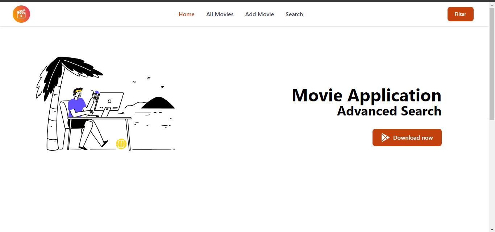

#A backend Application for Listing movies based on different criterias.


A backend Application for Listing movies based on different criterias.


# MovieList Application platform (v1)

>Simple Movie Listing with advanced search options using react and Tailwind CSS.





This project is part of my [Backend Project | Movie Listing Platform] Presidio Task. It is a full-featured Movie listing with advanced search Features. See it in action at (https://movielistapp-xi.vercel.app)

This is version 1.0 of the app. The first version can be found [here](https://movielistapp-xi.vercel.app)

<!-- toc -->

- [Features](#features)
- [Usage](#usage)
  - [Env Variables](#env-variables)
  - [Install Dependencies ](#install-dependencies)
  - [Run](#run)

## Features

- All Movie Listing
- Add a movie
- Search Movie
- Update Movie
- delete Movie
- seach based on different crieteria
- search by title
- search by director
- search by rating
- search by release year
- search by language


## Usage

- Create a MongoDB database and obtain your `MongoDB URI` - [MongoDB Atlas](https://www.mongodb.com/cloud/atlas/register)

### Env Variables

create the `.env` and add the following

```
PORT=5000
MONGODB_URI=your mongodb uri
CORS_ORIGIN= application frontend Url
PAGINATION_LIMIT=8
```

Change the  PAGINATION_LIMIT to what you want

### Install Dependencies (frontend & backend)

```
npm install

```

### Run

```

# Run backend only
npm run dev
```


#### Vite outputs the build to /dist

Create React App by default outputs the build to a **/build** directory and this is
what we serve from our backend in production.  
Vite by default outputs the build to a **/dist** directory so we need to make
some adjustments to our [src/index.js]
Change...


#### Vite has a different script to run the dev server

In a CRA project you run `npm start` to run the development server, in Vite you
start the development server with `npm run dev`  
If you are using the **dev** script in your root pacakge.json to run the project
using concurrently, then you will also need to change your root package.json
scripts from...


#### A final note:

Vite requires you to name React component files using the `.jsx` file
type, so you won't be able to use `.js` for your components. The entry point to
your app will be in `main.jsx` instead of `index.js`

And that's it! You should be good to go with the course using Vite.

---
